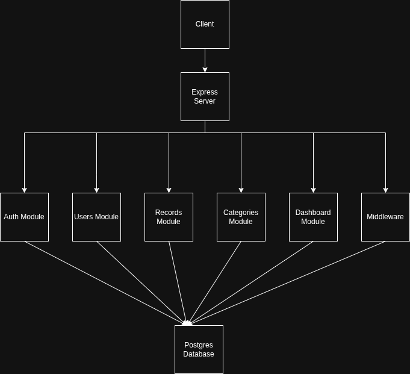
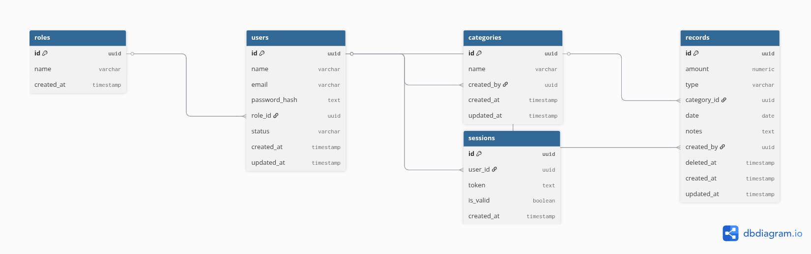

# Finance Data Processing Backend

## Overview

This project is a backend system for a finance dashboard that manages users, financial records, and analytics with role-based access control.

The system is designed with a focus on clean architecture, maintainability, and logical data flow.

---

## Tech Stack

* Node.js
* Express.js
* PostgreSQL
* JWT Authentication
* Zod (validation)

---

## Architecture

Layered modular architecture:

Routes → Controllers → Services → Database

Modules:

* Auth
* Users
* Records
* Categories
* Dashboard

### High-Level Design


### Entity Relationship Diagram


---

## Features

### Authentication

* User registration (default role: Viewer)
* JWT-based login
* Logout with token invalidation
* Current user endpoint

---

### User Management (Admin)

* Create, update, delete users
* Assign roles
* Activate / deactivate users
* Pagination support

---

### Financial Records

* Create, update, delete (soft delete)
* Filtering:

  * type
  * category
  * date range
* Pagination support
* Search functionality

---

### Categories

* System-defined and user-defined categories
* CRUD operations (admin)

---

### Dashboard APIs

#### Basic (Viewer)

* Total income
* Total expenses
* Net balance

#### Advanced (Analyst+)

* Category-wise breakdown
* Monthly and weekly trends
* Recent activity
* Top spending categories

---

## API Contract

### Authentication

* `POST /auth/register`
* `POST /auth/login`
* `POST /auth/logout`
* `GET /auth/me`

### Users

* `GET /users?page=1&limit=10&search=alex&role=analyst&status=active`
* `GET /users/:id`
* `POST /users` (admin only)
* `PATCH /users/:id` (admin only)
* `PATCH /users/:id/status` (admin only)
* `DELETE /users/:id` (admin only)

### Records

* `GET /records?page=1&limit=10&type=expense&category_id=<uuid>&from=2024-01-01&to=2024-01-31`
* `GET /records/search?q=rent&page=1&limit=10`
* `GET /records/:id`
* `POST /records` (admin only)
* `PATCH /records/:id` (admin only)
* `DELETE /records/:id` (admin only)

### Categories

* `GET /categories?page=1&limit=10&search=salary&is_system=true`
* `GET /categories/:id`
* `POST /categories` (admin only)
* `PATCH /categories/:id` (admin only)
* `DELETE /categories/:id` (admin only)

### Dashboard

* `GET /dashboard/summary?from=2024-01-01&to=2024-01-31`
* `GET /dashboard/analytics?from=2024-01-01&to=2024-01-31`

---

## Role Matrix

| Capability | Viewer | Analyst | Admin |
| --- | --- | --- | --- |
| Register / login / logout | Yes | Yes | Yes |
| View own profile (`/auth/me`) | Yes | Yes | Yes |
| View dashboard summary | Yes | Yes | Yes |
| View advanced analytics | No | Yes | Yes |
| Read own records | Yes | Yes | Yes |
| Read all records | No | Yes | Yes |
| Search records | No | Yes | Yes |
| Create records | No | No | Yes |
| Update records | No | No | Yes |
| Delete records | No | No | Yes |
| Access `/users` module | No | No | Yes |
| Create / update users | No | No | Yes |
| Activate / deactivate users | No | No | Yes |
| Access `/categories` module | No | No | Yes |
| Create / update / delete categories | No | No | Yes |

Inactive users are blocked by the auth middleware.

---

## Default Access

* New users registered through `POST /auth/register` default to the `viewer` role.
* All three supported roles are exactly `viewer`, `analyst`, and `admin`.

### Seed Credentials

Run `npm run seed` to load a stable demo dataset.

* `admin@zorvyn.com` / `admin123`
* `analyst@zorvyn.com` / `analyst123`
* `viewer@zorvyn.com` / `viewer123`

---

## Request / Response Examples

### Records list

Request:

```http
GET /records?page=1&limit=10&type=expense&from=2024-01-01&to=2024-01-31
Authorization: Bearer <token>
```

Response:

```json
{
  "data": [
    {
      "id": "uuid",
      "amount": "1200.00",
      "type": "expense",
      "category_id": "uuid",
      "category_name": "Expenses",
      "date": "2024-01-03",
      "notes": "Office rent",
      "created_by": "uuid",
      "created_by_email": "viewer@zorvyn.com",
      "created_at": "2024-01-03T10:00:00.000Z",
      "updated_at": "2024-01-03T10:00:00.000Z",
      "deleted_at": null
    }
  ],
  "pagination": {
    "page": 1,
    "limit": 10,
    "total": 1,
    "pages": 1
  }
}
```

### Create record

Request:

```http
POST /records
Authorization: Bearer <admin-token>
Content-Type: application/json
```

```json
{
  "amount": 250,
  "type": "income",
  "category_id": "uuid",
  "date": "2024-02-01",
  "notes": "Monthly salary"
}
```

Response:

```json
{
  "data": {
    "id": "uuid",
    "amount": "250.00",
    "type": "income",
    "category_id": "uuid",
    "category_name": "Salary",
    "date": "2024-02-01",
    "notes": "Monthly salary",
    "created_by": "uuid",
    "created_by_email": "admin@zorvyn.com",
    "created_at": "2024-02-01T10:00:00.000Z",
    "updated_at": "2024-02-01T10:00:00.000Z",
    "deleted_at": null
  }
}
```

### Dashboard summary

Request:

```http
GET /dashboard/summary?from=2024-01-01&to=2024-01-31
Authorization: Bearer <token>
```

Response:

```json
{
  "data": {
    "total_income": "5000.00",
    "total_expenses": "1200.00",
    "net_balance": "3800.00",
    "total_records": 2,
    "categories_used": 2
  }
}
```

### Dashboard analytics

Response shape:

```json
{
  "data": {
    "category_breakdown": [],
    "monthly_trends": [],
    "weekly_trends": [],
    "recent_activity": [],
    "top_spending_categories": [],
    "range": {
      "from": "2024-01-01",
      "to": "2024-01-31"
    }
  }
}
```

---

## Validation & Error Handling

* Request validation uses Zod.
* Centralized error handling returns consistent JSON responses.
* Role checks are enforced at middleware and service level for sensitive actions.
* Transactional writes roll back on failure.

---

## Database Design

Entities:

* Users
* Roles
* Records
* Categories
* Sessions

Key design decisions:

* UUID primary keys
* Normalized roles table
* Soft delete for records
* Indexed fields for filtering and lookup
* Explicit transactions for multi-step writes

---

## Setup Instructions

1. Clone the repository.
2. Install dependencies:
   `npm install`
3. Create `backend/.env` with:
   * `DATABASE_URL=your_db_url`
   * `JWT_SECRET=your_secret`
   * `PORT=3000`
4. Run migrations:
   `npm run migrate`
5. Seed demo data:
   `npm run seed`
6. Start the backend:
   `npm run dev`

---

## Test Scripts

* `npm test`
* `npm run test:unit`
* `npm run test:integration`
* `npm run test:dashboard`

---

## Assumptions

* JWT is used without refresh tokens.
* Categories can be system-defined or user-created.
* Only `admin` can create, update, or delete financial records.
* `viewer` can only read its own records and the base dashboard summary.
* `analyst` can read all permitted records and access advanced dashboard analytics.

---

## Trade-offs

* Simplified authentication flow.
* Monolithic architecture.
* Limited session management.
* Dashboard analytics are computed on demand rather than cached.

---

## Future Improvements

* Refresh tokens
* Rate limiting
* Caching
* API documentation with OpenAPI

---

## Conclusion

This project demonstrates backend system design with a focus on architecture, access control, and data modeling. It is structured to support a frontend dashboard with stable role-based behavior and deterministic seed data.
